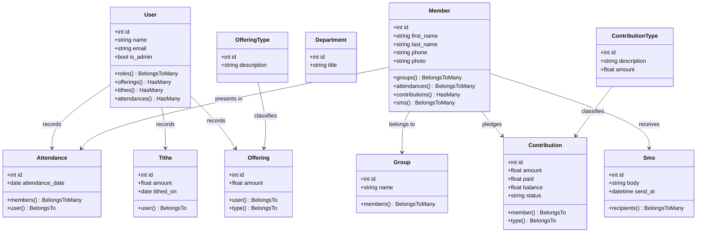

# Church Management System Architecture Reference

This directory serves as the documentation hub for the Church Management System's architecture, design decisions, domain definitions, and implementation guidelines.

---

## 1. Executive Summary & Vision

The system is a centralized church administration platform designed to:
* **Manage Core Membership**: Track details of church members including contact info, photos, groups, and department associations.
* **Organize Church Hierarchy**: Structure the congregation into **Groups** and **Departments**.
* **Financial Stewardship**: Securely audit and record **Tithes**, **Offerings**, and dedicated **Contributions** (pledges/project funds).
* **Communication & Engagement**: Connect with members via a scheduled SMS notification hub integrated with the Africa's Talking API.
* **Operational Audits**: Record weekly member **Attendance** and generate PDF reports for church administration.

---

## 2. Technical Stack

* **Backend Framework**: Laravel 11.x (PHP 8.2+) leveraging strict Eloquent relations.
* **Frontend Framework**: Vue 3 (Composition API using `<script setup lang="ts">`) and TypeScript.
* **State & Routing**: Inertia.js (routing and backend-data sharing without a custom REST API).
* **CSS & Aesthetics**: Vanilla CSS alongside Tailwind CSS (used for dashboard, layout, and utility classes).
* **Data Visualization**: Chart.js (for tracking tithes, attendances, and registration metrics on the Dashboard).
* **PDF Rendering**: Barryvdh DomPDF (`barryvdh/laravel-dompdf`) for generating downloadable documents.
* **Messaging Integration**: Africa's Talking SMS API gateway.

---

## 3. Architecture & Domain Domain Models

The relational schema is composed of several interdependent domain groups:

### 3.1. Authentication & Roles
* **User**: Represents church administrators and office staff. Authenticated via Laravel Breeze. Includes an `is_admin` attribute for access controls.
* **Role**: Defines permissions mapped to system users.

### 3.2. Membership & Organization
* **Member**: The central entity representing a congregant. Contains fields for personal details, gender-based placeholder avatars, and contact information.
* **Group** and **Department**: Logical groupings. A member can belong to multiple groups or departments to coordinate ministry tasks.

### 3.3. Financial Management
* **Tithe**: Monitored individually. Every tithe is linked to the `User` (clerk) who entered it for auditing purposes.
* **Offering**: Tracked via `OfferingType` (e.g. Sunday Service, Building Fund, Benevolence) and recorded by an admin.
* **Contribution**: Represents dedicated pledges towards targeted goals. Each contribution tracks the targeted `amount`, the `paid` amount, and automatically maintains a `balance` status.

### 3.4. Communication Hub
* **Sms**: Model containing the payload body and scheduled time.
* **MemberSms**: Pivot table mapping messages to multiple member recipients, recording delivery status and gateway `messageId`. Messages are dispatched in the background by a Laravel console command.

---

## 4. Coding & Architecture Standards

### 4.1. TypeScript Guidelines
* **Centralization**: All shared TypeScript interfaces representing database models or payload objects must be centralized in **[resources/js/types/index.d.ts](file:///home/ogilo/Projects/church/church/resources/js/types/index.d.ts)**. No local interfaces should duplicate these.
* **Type Safety**: Avoid using `any` types for domain objects; refer instead to the centralized definitions (e.g. `iMember`, `iContribution`, `iNotification`).

### 4.2. Vue 3 Standards
* **Script Setup**: All components must use `<script setup lang="ts">`.
* **State Synchronization**: Avoid local state watchers that interfere with global layouts. Global UI states, like sidebar toggles, must be owned at the parent layout level (`AppLayout.vue`), synced with `localStorage`, and passed down as props to ensure persistence.
* **Notification System**: Global alerts and flash notifications are shared from the backend via Inertia session props and watched through the standard `notification` property in Vue templates.
