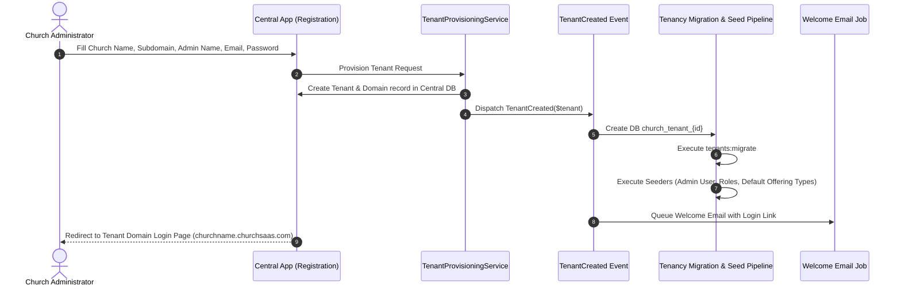

# Tenant Self-Onboarding & Provisioning Workflow

## Overview
Self-onboarding allows a new church to register on the Central Application (`churchsaas.com/register`) and automatically receive an isolated tenant workspace (`churchname.churchsaas.com`) within seconds.

## Sequence Flow



## Provisioning Service Implementation

```php
declare(strict_types=1);

namespace App\Services\Central;

use App\DataTransferObjects\OnboardingData;
use App\Models\Central\Tenant;
use Illuminate\Support\Facades\DB;

final class TenantProvisioningService
{
    public function provision(OnboardingData $data): Tenant
    {
        return DB::connection('central')->transaction(function () use ($data) {
            $tenant = Tenant::create([
                'id' => $data->subdomain,
                'data' => [
                    'church_name' => $data->churchName,
                    'admin_name' => $data->adminName,
                    'admin_email' => $data->adminEmail,
                    'admin_password' => bcrypt($data->adminPassword),
                    'phone' => $data->phone,
                ],
            ]);

            $tenant->domains()->create([
                'domain' => $data->subdomain . '.' . config('tenancy.central_domains.0'),
                'is_primary' => true,
            ]);

            return $tenant;
        });
    }
}
```
